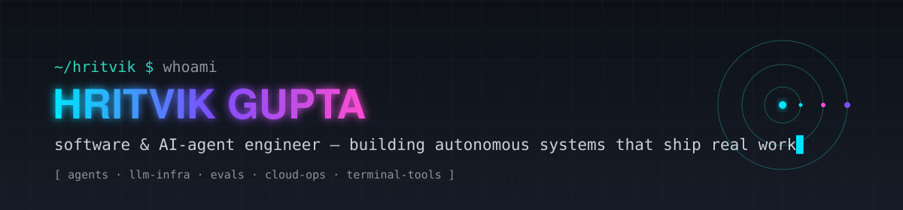

```typescript
const hritvik: AgentEngineer = {
  role:     "Software & AI-Agent Engineer @ Penn Medicine · Verma Lab",
  thesis:   "agents should do real work — not demos",
  building: ["autonomous agents", "LLM infrastructure", "agent evals & benchmarks"],
  runtime:  { languages: ["Python", "TypeScript", "Swift"], degree: "MS CompE, UC Riverside" },
  now:      "multi-agent orchestration · longitudinal agent memory · self-hosted agent infra",
};
```

[](https://hritvikgupta.in/)
[](https://linkedin.com/in/hritvik-gupta)
[](mailto:hritvik2920@gmail.com)

## ⚡ Open Source — agents that ship

<a href="https://github.com/hritvikgupta/nimbus"></a>
<a href="https://github.com/hritvikgupta/reagent"></a>
<a href="https://github.com/hritvikgupta/Archimyst-Terminal"></a>
<a href="https://github.com/hritvikgupta/trytine"></a>

| | |
|---|---|
| ☁️ **[nimbus](https://github.com/hritvikgupta/nimbus)** | *Talk to your cloud.* Self-hostable agent that reads your code, operates AWS & GCP, and opens PRs — `CloudWatch → root cause → fix → PR`, on its own |
| 🔬 **[reagent](https://github.com/hritvikgupta/reagent)** | Autonomous research agents: read the literature, weigh the evidence, run the experiment, return a cited, reproducible answer |
| 🖥️ **[Archimyst Terminal](https://github.com/hritvikgupta/Archimyst-Terminal)** | Native agentic coding engineer for the terminal — design, build, debug, and ship production systems from the CLI |
| 🍎 **[tine](https://github.com/hritvikgupta/trytine)** | Native macOS AI companion, written in Swift |

## 🧠 How I think about agents

```
perception ──▶ reasoning ──▶ action ──▶ verification
    ▲                                        │
    └────────────── memory ◀─────────────────┘
```

- **Tools over talk** — an agent's output is a side-effect in the real world (a PR, a schedule, an escalation), not a paragraph
- **Memory is the hard part** — continuity across sessions beats brilliance within one
- **Evals or it didn't happen** — every agent I ship gets a benchmark harness with deterministic checks before it meets users
- **Self-hostable by default** — your data, your infra, your agent

## 🔬 Research

- Genome-wide pleiotropy analysis — *medRxiv, 2025*
- Extractive text summarization with ELMo — *IEEE I-SMAC*
- EEG microstate analysis with RNNs — *i-PACT*
- LSA topic modeling + BERT — *AI Smart Systems*

## 🛰️ Stack


## 📡 GitHub

<p align="center">
  
  
</p>

<p align="center"><sub><code>~/hritvik $ agents --status</code> → <b>shipping</b> ▊</sub></p>
