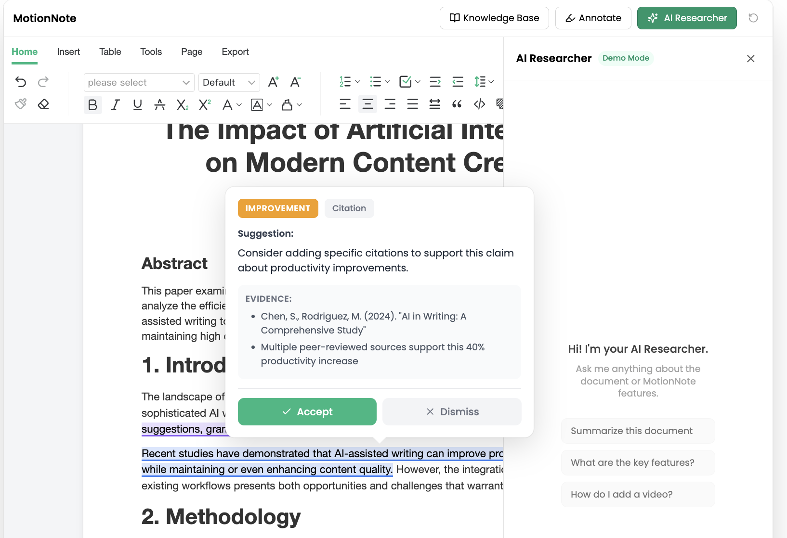
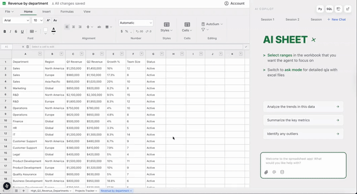

<h1 align="center">👋 Hi, I'm Hritvik Gupta</h1>
<h3 align="center">AI Engineer • LLM Systems • RAG Architect • Full-Stack AI Builder • Founder of MotionNote · StoryBorrd · Awaken</h3>

  

---

# 🛠️ **Tech Stack**

<!-- AI/ML -->

<!-- Backend / DevOps -->
 

<!-- Data Engineering -->
 

<!-- Frontend -->
 

<!-- Analytics / BI -->
 

---

# 🌟 **About Me**

I’m an **AI Engineer** specializing in:

- Large Language Models (LLMs)  
- Retrieval-Augmented Generation (RAG)  
- Voice + Chat AI Agents  
- Vector search (FAISS, LlamaIndex)  
- Multimodal reasoning  
- Distributed Data Engineering (Spark + Delta Lake)  
- Full-stack AI SaaS development  

I’ve built:

- 🎤 **AI Voice Chat Agent** used by **100,000+ patients**  
- 🧠 RAG engines for genomics + scientific research  
- 📝 AI Word Processor (MotionNote)  
- 🧩 AI Research Canvas (StoryBorrd)  
- 🎙️ AI Avatar Studio (Awaken)  
- 📊 Predictive analytics used by 5000+ employees  

---

# 🧠 **Experience**

## **AI Engineer — Penn Medicine** (Jul 2024 - Present)
- Built an AI Voice & Chat system for Perception Care used by 100K+ West Coast patients; designed multilingual speech → RAG → LLM pipeline using LlamaIndex, FAISS, LangChain, FastAPI, and Docker.
- Engineered data generation for speech and language models retrieval, vector search, and prompt-routing workflows, reducing response latency by ~28% and improving clinical-text retrieval accuracy by 22%.
- Enhanced PLATLAS genomics platform with ML-based variant ranking and phenotype-similarity scoring; collaborated with Argonne National Lab and leveraged the Aurora supercomputer to run 27M-SNP Nextflow pipelines and added LLM-guided GWAS/EXWAS analysis.
- Developed PySpark + Delta Lake pipelines standardizing 30+ clinical datasets into OMOP, enabling real-time cohort building and disease-trend dashboards.

---

## **Graduate Researcher (NLP) — University of California, Riverside** (Oct 2022 – Dec 2023)
- Built large-scale NLP pipelines (Python, Spark, SQL) for 10M+ multilingual research documents, improving tokenization + embedding generation speed by ~40% for downstream scientific analysis.
- Optimized RAG systems using LlamaIndex + LangChain, raising scientific text retrieval accuracy by 22% and reducing context-window failures through improved chunking + prompt-routing.

---

## **Data Analyst — Cognizant** (Aug 2021 – Aug 2022)
- Built Python + SQL ETL pipelines processing 20K+ HR, payroll, and marketing records across 50 operational datasets, improving data accuracy and reconciliation reliability by ~35%.
- Developed Scikit-learn + SAS predictive models for attrition and hiring demand, improving workforce planning accuracy and staffing decisions for 5,000+ employees.  

---

# 🚀 **AI Products (Founder)**

## 📝 **MotionNote — AI Word Processor**

**The Open Source AI-Powered Word Processor**

MotionNote is the fastest and easiest way to create, edit, and enhance documents with AI assistance. It turns **text → charts → diagrams → videos** using AI.

- **Chart + Diagram Generator**: Select text to convert to charts/graphs.
- **Video Generation**: Convert notes into high-quality explainer videos.
- **RAG-Powered Contextual Memory**: Chat with your documents.
- **AI Copilot**: Intelligent writing companion.
- **Tech Stack**: FastAPI + Supabase + CopilotKit + Vue 3.

🔗 [motionnote.com](https://motionnote.com)

---

## 📊 **MotionExcel — AI Data Analyst**

**Automated Data Analysis & Visualization Dashboard**

MotionExcel transforms raw data into actionable insights using AI-driven SQL generation and Python analysis.

- **Text-to-SQL**: Query your database using natural language.
- **Automated Dashboards**: Instantly generate visual dashboards from your data.
- **Python Data Analysis**: Run complex Python analysis scripts on your spreadsheet data.
- **Pivot Tables & Charts**: Create pivot tables and charts with a single click.

### 🎥 **Demos**
- [📊 Dashboard Generation](./motionexcel/videos/dashboard%20(1).mp4)
- [🐍 Python Data Analysis](./motionexcel/videos/pythontest.mp4)
- [🗄️ Text to SQL](./motionexcel/videos/sql.mp4)
- [📈 Smart Pivot Tables](./motionexcel/videos/pivot%20(1).mp4)

---

## 🧠 **StoryBorrd — AI Research Canvas**  

Figma-style AI canvas for research, storytelling & multimodal workflows.

- 200+ AI models integrated  
- Graph-memory engine  
- RAG over docs, tables, PDFs  
- Multimodal reasoning  
🔗 https://storyborrd.com  

---

## 🎙️ **Awaken — AI Avatar Studio**  

Lifelike AI avatar video generation.

- Realistic speech-sync avatars  
- Voice cloning  
- Slide / script sync  
- Automated invoice system  
🔗 https://awaken.sh  

---

# 📚 **Publications**

- Genome-Wide Pleiotropy Analysis — *medRxiv, 2025*  
- Extractive Text Summarization (ELMo) — *IEEE I-SMAC*  
- EEG Microstate Analysis (RNN) — *i-PACT*  
- LSA Topic Modeling + BERT — *AI Smart Systems*  

---

# 🏆 **Awards**

- **Health-Tech Innovation Accelerator Award – Penn Health-Tech (2025)**, CIRCA Voice-AI For General Healthcare Services to patients

---

# 🎓 **Education**

- **Masters In Computer Engineering** — University of California - Riverside (Sep 2022 – Dec 2023)
- **B.Tech Computer Science** — GITS Udaipur  

---

# 📊 **GitHub Analytics**

  <!-- GitHub Stats (Using a backup mirror to fix loading issues) -->
  
  
  <!-- GitHub Streak (Fixed: switched from herokuapp to demolab) -->
  
  
   
  
  <!-- Top Languages -->
  

---

# 🤝 **Connect With Me**

📧 Email: **hritvik2920@gmail.com**  
🔗 LinkedIn: https://linkedin.com/in/hritvik-gupta  
💻 GitHub: https://github.com/hritvikgupta  

---

# 😄 **Fun Fact**

Every AI product starts as a tiny script…  
and then becomes your entire life 😂

