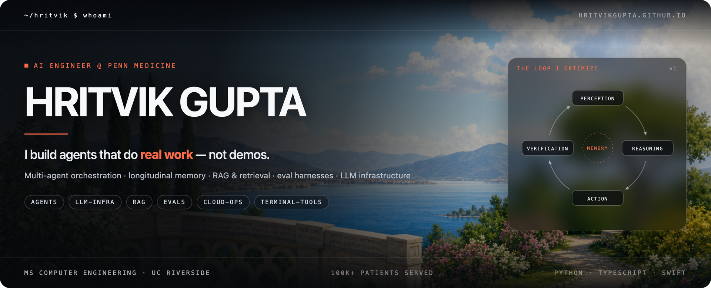
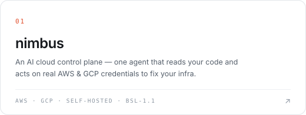
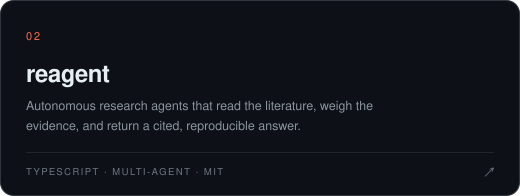
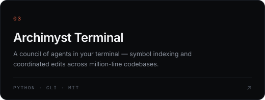
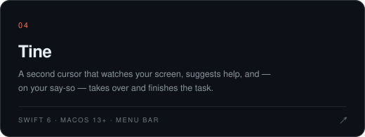
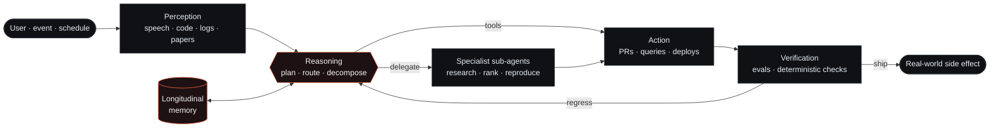
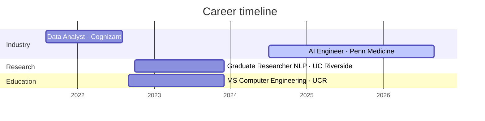

<p align="center">
  <a href="https://hritvikgupta.github.io/hritvik-gupta/"></a>
  <a href="https://www.linkedin.com/in/hritvik-gupta-link/"></a>
  <a href="mailto:hritvik2920@gmail.com"></a>
</p>

<p align="center">
  
  <a href="https://github.com/hritvikgupta?tab=followers"></a>
  
  
</p>

---

## 👋 About me

I'm **Hritvik** — an AI engineer at **Penn Medicine (Verma Lab)**, where I ship voice and chat systems that real patients actually use. Outside of work I build **autonomous agents**: things that read your code, operate your cloud, read the literature, and hand back a result you can verify.

My bet is simple: the interesting part of an agent isn't the model, it's the loop around it — memory, tools, and evals. Most agents feel dumb because they forget, not because they can't reason.

```yaml
name:      Hritvik Gupta
role:      AI Engineer @ Penn Medicine · Verma Lab
education: MS Computer Engineering, UC Riverside
thesis:    "agents should do real work — not demos"
building:  [autonomous agents, LLM infrastructure, agent evals & benchmarks]
languages: [Python, TypeScript, Swift, SQL, C++]
now:       multi-agent orchestration · longitudinal memory · self-hosted agent infra
ask-me-about: [RAG at scale, agent evals, multilingual speech pipelines, genomics ML]
```

<table>
<tr>
<td width="25%" align="center"><b>100K+</b><br /><sub>patients served by the voice&nbsp;&amp;&nbsp;chat system I built</sub></td>
<td width="25%" align="center"><b>27M</b><br /><sub>SNPs processed on Argonne's Aurora supercomputer</sub></td>
<td width="25%" align="center"><b>10M+</b><br /><sub>multilingual research documents in NLP pipelines</sub></td>
<td width="25%" align="center"><b>4</b><br /><sub>peer-reviewed publications</sub></td>
</tr>
</table>

---

## 🚀 What I'm building

<div>
<a href="https://github.com/hritvikgupta/nimbus"></a>
<a href="https://github.com/hritvikgupta/reagent"></a>
<a href="https://github.com/hritvikgupta/Archimyst-Terminal"></a>
<a href="https://github.com/hritvikgupta/trytine"></a>
</div>

<details>
<summary><b>More projects →</b></summary>

<br />

| Project | What it is |
|---|---|
| [**chytra**](https://github.com/hritvikgupta/chytra) | AI-powered research and creative canvas — Figma-style design surface wired to 200+ models, with a graph-memory architecture that connects ideas, documents, and findings |
| [**worklone**](https://github.com/hritvikgupta/worklone) | Next-generation AI spreadsheet and agentic framework — natural-language data workflows, a built-in Data Scientist agent, and multi-agent request routing |
| [**probeqa**](https://github.com/hritvikgupta/probeqa) | Agentic QA — a real testing agent that drives the app instead of asserting on mocks |
| [**voiceai**](https://github.com/hritvikgupta/voiceai) | Real-time voice agent stack: streaming STT → LLM brain → TTS |
| [**docuwriters**](https://github.com/hritvikgupta/docuwriters) | Documentation that writes and maintains itself from the codebase |

</details>

---

## 🧠 How I build agents



**Tools over talk.** An agent's output is a side effect in the real world — a merged PR, a rolled-back deploy, an escalation — not a paragraph that reads well.

**Memory is the hard part.** Continuity across sessions beats brilliance inside one. Every agent I ship gets a working-memory document it maintains itself.

**Evals or it didn't happen.** A benchmark harness with deterministic checks goes in *before* the agent meets a user, not after it embarrasses one.

**Self-hostable by default.** Your data, your infrastructure, your keys. Anything holding production credentials should run where you can watch it.

---

## 💼 Experience



<details open>
<summary><b>AI Engineer</b> · Penn Medicine · <i>Jul 2024 – Present</i></summary>

- Built an **AI voice & chat system for Perception Care** used by **100K+ West Coast patients** — a multilingual `speech → RAG → LLM` pipeline on LlamaIndex, FAISS, LangChain, FastAPI, and Docker.
- Engineered data generation for speech and language model retrieval, vector search, and prompt-routing workflows — **~28% lower response latency**, **+22% clinical-text retrieval accuracy**.
- Enhanced the **PLATLAS genomics platform** with ML-based variant ranking and phenotype-similarity scoring; ran **27M-SNP Nextflow pipelines on Argonne's Aurora supercomputer**.
- Developed **PySpark + Delta Lake** pipelines standardizing **30+ clinical datasets into OMOP**, enabling real-time cohort building and disease-trend dashboards.

</details>

<details>
<summary><b>Graduate Researcher (NLP)</b> · University of California, Riverside · <i>Oct 2022 – Dec 2023</i></summary>

- Built large-scale NLP pipelines (Python, Spark, SQL) over **10M+ multilingual research documents**, improving tokenization and embedding generation speed by **~40%**.
- Optimized RAG systems with LlamaIndex + LangChain, raising scientific-text retrieval accuracy by **22%**.

</details>

<details>
<summary><b>Data Analyst</b> · Cognizant · <i>Aug 2021 – Aug 2022</i></summary>

- Built Python + SQL ETL pipelines over **20K+ HR, payroll, and marketing records across 50 datasets**, improving data accuracy by **~35%**.
- Developed Scikit-learn + SAS predictive models for attrition and hiring demand, improving workforce planning for **5,000+ employees**.

</details>

---

## 🛠️ Tech stack

<table>
<tr><td><b>Languages</b></td><td>


</td></tr>
<tr><td><b>AI &amp; agents</b></td><td>


</td></tr>
<tr><td><b>Backend</b></td><td>


</td></tr>
<tr><td><b>Data</b></td><td>


</td></tr>
<tr><td><b>Cloud &amp; infra</b></td><td>


</td></tr>
</table>

---

## 📊 GitHub statistics

<p align="center">
  
  
</p>

<p align="center">
  
</p>

<p align="center">
  
  
</p>

### 🏆 Trophies

<p align="center">
  
</p>

### 📈 Contribution activity

<p align="center">
  
</p>

<picture>
  <source media="(prefers-color-scheme: dark)" srcset="https://raw.githubusercontent.com/hritvikgupta/hritvikgupta/output/github-snake-dark.svg" />
  <source media="(prefers-color-scheme: light)" srcset="https://raw.githubusercontent.com/hritvikgupta/hritvikgupta/output/github-snake.svg" />
  
</picture>

---

## 📄 Publications &amp; recognition

| Year | Work | Venue |
|:--|:--|:--|
| 2025 | Levin, M.G., *et al.* (incl. **Gupta, H.**) — *Genome-Wide Assessment of Pleiotropy Across >1000 Traits from Global Biobanks* | medRxiv |
| 2021 | **Gupta, H.** & Patel, M. — *Text Summarization: LSA Topic Modelling with BERT* | AI Smart Systems |
| 2021 | Gupta, S. & Kal, H. — *Microstate EEG Analysis via RNN* | i-PACT |
| 2020 | Patel, M. & **Gupta, H.** — *Extractive Text Summarization Using ELMo* | IEEE I-SMAC |

> 🏅 **Health-Tech Innovation Accelerator Award** — Penn Health-Tech, 2025
> *CIRCA: Voice-AI for general healthcare services to patients.*

---

## 🤝 Let's build something

I'm always up for a conversation about agents that have to work in the real world — production credentials, messy data, users who notice when it's wrong.

<p align="center">
  <a href="https://hritvikgupta.github.io/hritvik-gupta/"></a>
  <a href="https://www.linkedin.com/in/hritvik-gupta-link/"></a>
  <a href="mailto:hritvik2920@gmail.com"></a>
  <a href="https://github.com/hritvikgupta?tab=repositories"></a>
</p>

<p align="center"><sub><code>~/hritvik $ agents --status</code> → <b>shipping</b></sub></p>
