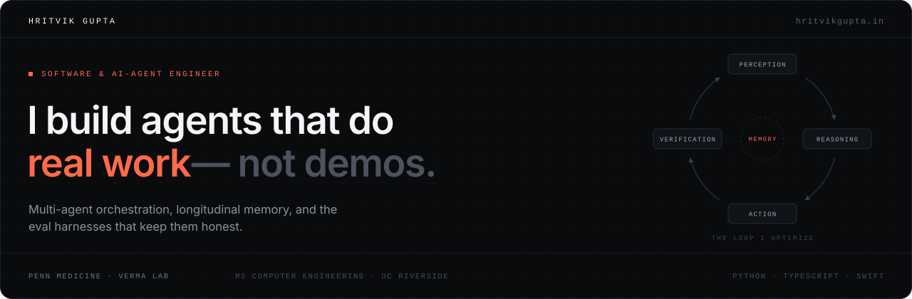
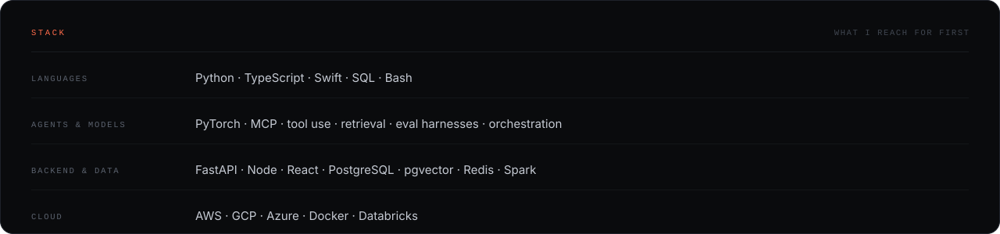

**[Portfolio](https://hritvikgupta.in/)** &nbsp;·&nbsp; **[LinkedIn](https://linkedin.com/in/hritvik-gupta)** &nbsp;·&nbsp; **[Email](mailto:hritvik2920@gmail.com)**

## Selected work

## How I build

**Tools over talk.** An agent's output is a side effect in the real world — a merged PR, a rolled-back deploy, an escalation — not a paragraph that reads well.

**Memory is the hard part.** Continuity across sessions beats brilliance inside one. Most agents feel dumb because they forget, not because they can't reason.

**Evals or it didn't happen.** Every agent I ship gets a benchmark harness with deterministic checks before it ever meets a user.

**Self-hostable by default.** Your data, your infrastructure, your keys. An agent with production credentials should run where you can see it.

## Stack

## Research

- **Genome-wide pleiotropy analysis** — *medRxiv*, 2025
- **Extractive text summarization with ELMo** — *IEEE I-SMAC*
- **EEG microstate analysis with recurrent networks** — *i-PACT*
- **LSA topic modeling with BERT** — *AI Smart Systems*

---

Software &amp; AI-agent engineer at Penn Medicine · Verma Lab. Happy to talk about agents that have to work in the real world — <a href="mailto:hritvik2920@gmail.com">hritvik2920@gmail.com</a>
